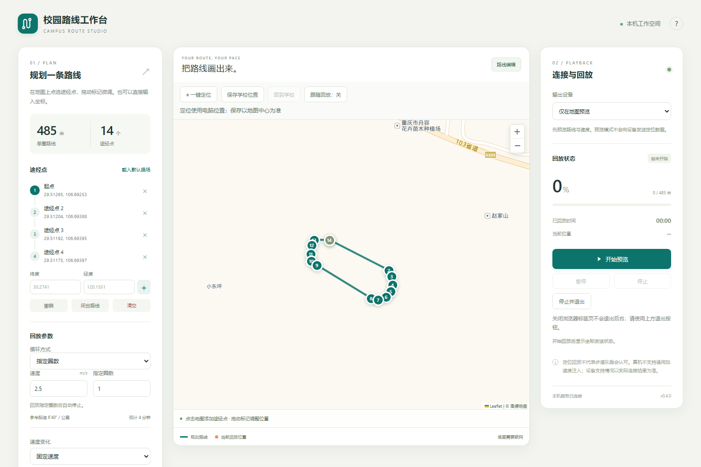
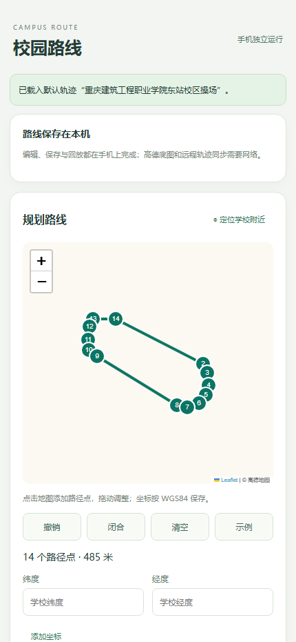

# 校园路线工作台

很抱歉安卓版本（包括模拟器）目前存在无法定位的bug，具体表现为启动辅助软件之后乐跑软件上面定位虽然发生更新但没有出现移动，但我们仍然保留了安卓版本的安装包但是安装之后可能无法正常使用，我们对用户造成的不便表达十分歉意，如果您有解决方法欢迎Issues或Fork。   通过电脑端数据线连接手机仍然可以正常使用。

在高德地图上规划路线，按速度与循环设置回放位置。提供 Windows 桌面版、Android 独立版，并支持 MuMu、Android USB 与 iPhone USB 连接。

## 先看使用流程

| Windows 桌面版 | Android 独立版 |
| --- | --- |
|  |  |

### Windows：下载后直接运行

1. 打开 [Releases](https://github.com/Chanray-May9/campus-route-studio/releases/latest)，下载 `CampusRouteStudio-Windows.zip`。
2. 解压到普通文件夹，双击 `start.cmd`。浏览器会自动打开本机工作台。
3. 在地图上点击添加路径点，也可以拖动点位、导入 GPX/GeoJSON，或用“一键定位”找到学校附近。
4. 设置基础速度、变速方式、左右摆幅、指定圈数或无限循环。先选“仅在地图预览”检查路线。
5. 需要连接设备时，在右侧选择 Android、MuMu 或 iOS，按对应步骤连接，再开始回放。
6. 用“停止并退出”结束后台服务；只关闭浏览器标签页不会退出。

### Android：手机独立运行

1. 从 [Releases](https://github.com/Chanray-May9/campus-route-studio/releases/latest) 下载 `CampusRoute-Mobile.apk` 并安装。系统要求 Android 8 或更高版本。
2. 打开系统“开发者选项” → “选择模拟位置信息应用”，选择“校园路线”。
3. 回到 App，授予精确位置权限，并确认系统定位开关已打开。
4. 在高德地图上规划路线，设置速度、摆动和循环次数；也可以从轨迹库载入已有路线。
5. 勾选场地确认后开始回放。状态行会显示实际启用的 `gps` / `network` 提供器和已发送次数。
6. 回放期间可以切换到其他 App；从通知栏或 App 内停止。若后台被系统结束，请允许“校园路线”后台运行。

学校要求只能在操场跑时，请按实际操场边界准确规划并自行核对学校规定。目标软件可能识别 Android 模拟位置或采用额外的运动数据校验，本项目不能保证目标软件接受记录。

### Windows 连接 Android 或 MuMu

1. 手机打开 USB 调试并确认电脑授权；MuMu 请在设置中打开 ADB 调试。
2. 桌面版选择“Android / MuMu（ADB）”，刷新设备并选中目标设备。
3. 点击“安装定位助手并打开设置”。在设备开发者选项里把 `Route Studio Helper` 设为模拟位置应用。
4. 回到工作台开始回放。若启动失败，先在设备上打开助手，授予权限并点击“启动位置回放服务”。

MuMu 的 ADB 地址和端口以实例设置为准。也可以选择“MuMu（管理器定位）”，填写 `MuMuManager.exe` 路径和实例编号。

### Windows 连接 iPhone

1. 用数据线连接 iPhone，解锁后选择“信任此电脑”，并安装 Apple 设备驱动。
2. 打开 iPhone 开发者模式；首次连接可能需要准备匹配系统版本的开发者服务文件。
3. 桌面版选择“iPhone / iPad（USB）”，刷新并选中设备，再开始回放。
4. iOS 17.0–17.3.1 在 Windows 上需要管理员权限运行 `pymobiledevice3 remote tunneld`；iOS 17.4 及以上由程序尝试建立 userspace tunnel。

## 主要功能

- 高德国内底图；地图按 GCJ-02 显示，路线文件和设备回放保持 WGS84。
- 地图点击、拖动、撤销、闭合、一键定位和学校位置保存。
- 导入 GPX、GeoJSON、JSON，导出 GPX 与 GeoJSON。
- 本地轨迹库；Android 版也可同步维护者发布的公共轨迹。
- 内置“重庆建筑工程职业学院东站校区操场”默认轨迹，单圈约 485 米。
- 固定速度、平滑变速、突然快慢变化、轨迹左右摆动。
- 指定圈数与无限循环；运行中可调整速度和摆动参数。
- Windows 支持 Android/MuMu、MuMu 管理器、iOS USB 与 Android 官方模拟器。

## 常见问题

#### 安卓提示没有模拟位置权限
确认开发者选项里选择的是当前使用的 App：手机独立版选“校园路线”，桌面版连接手机时选 `Route Studio Helper`。两个 App 不能同时成为模拟位置应用。还要授予精确位置权限并打开系统定位。

#### 状态显示在移动，但另一个 App 不动
先打开系统地图核对位置。新版会分别注册 GPS 和网络提供器，只要一个可用就继续，并在状态里显示实际提供器。部分 App 使用自己的定位缓存或检测模拟位置，可尝试强制停止目标 App 后重新打开。

#### 地图空白
检查能否访问 `webrd01.is.autonavi.com`。底图需要网络；路线编辑、坐标输入、导入和设备回放本身不依赖地图瓦片。

#### Windows 没检测到手机
Android 请检查 USB 调试授权和 ADB 驱动；iPhone 请保持解锁、确认信任，并检查 Apple Mobile Device 驱动。换一条支持数据传输的线和 USB 端口通常也有帮助。

## 技术说明

路线统一保存为 WGS84。高德底图采用 GCJ-02，因此前端只在绘制与地图交互时转换坐标：显示前执行 WGS84 → GCJ-02，点击或拖动后执行 GCJ-02 → WGS84。发给 Android、MuMu 和 iOS 的坐标不会经过地图坐标偏移。

| 模式 | 定位实现 | 运动传感器 |
| --- | --- | --- |
| 地图预览 | 本机插值计算 | 不发送 |
| Android USB / MuMu ADB | Android GPS/network 测试提供器 | 真机不提供通用传感器注入 |
| MuMu 管理器 | MuMuManager 定位命令 | 不发送 |
| iOS USB | Apple 开发者定位服务 / DVT tunnel | 不发送 |
| Android 官方模拟器 | Emulator console geo fix | 可选回放加速度 |

Android 坐标带有系统的 mock 标记。助手收到更新时会重置 10 秒看门狗；电脑断开且服务仍存活时会尝试移除测试提供器。普通 Android 没有面向第三方 App 的通用加速度、陀螺仪或计步器注入接口。

### 本地开发

需要 Python 3.11 及以上版本：

```powershell
py -3.12 -m unittest discover -s tests -v
py -3.12 launch.py
```

构建 Android APK 需要 JDK 17、Android SDK Platform 35 和 Build Tools 35：

```powershell
py -3.12 scripts/build_android.py --source-dir mobile --apk-name CampusRoute-Mobile.apk
py -3.12 scripts/build_android.py
```

`cloudflare/` 提供 Workers + D1 公共轨迹服务。公开读取接口为 `GET /api/routes`，管理接口使用 `CR_ADMIN_TOKEN`，部署步骤见 [Cloudflare 说明](cloudflare/README.md)。

项目采用 [GPL-3.0-or-later](LICENSE) 许可证。第三方组件与许可见 [NOTICE](NOTICE)。
